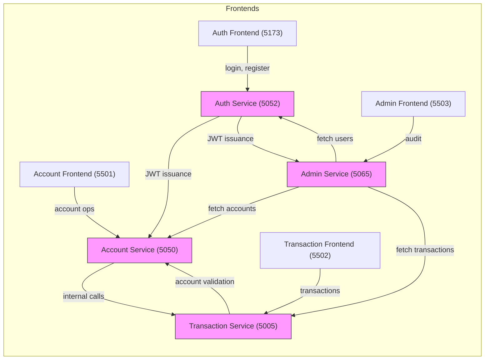
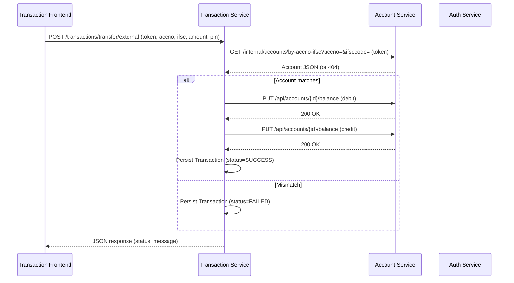
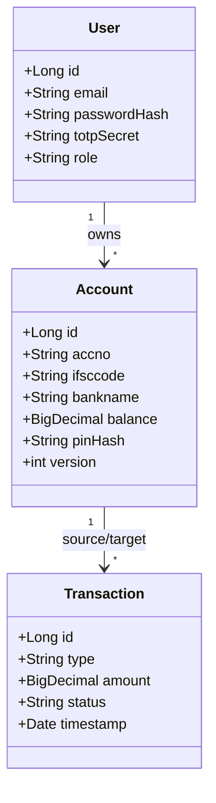

# 📚 Aegis Capital Banking System – Complete Project Documentation

**Version:** 1.0.0 (April 2026) | **Author:** Aegis Development Team | **Last Updated:** 2026-04-08

## Table of Contents

1. [Project Overview](#1-project-overview)
2. [High-Level Architecture](#2-high-level-architecture)
3. [Micro-Services Detail](#3-micro-services-detail)
    - [Auth Service](#31-auth-service)
    - [Account Service](#32-account-service)
    - [Transaction Service](#33-transaction-service)
    - [Admin Service](#34-admin-service)
4. [Technology Stack & Rationale](#4-technology-stack--rationale)
5. [Data Model & Persistence](#5-data-model--persistence)
6. [Security Model](#6-security-model)
7. [API Design & Contracts](#7-api-design--contracts)
8. [Frontend UI/UX](#8-frontend-uiux)
9. [Build, Run & Deployment](#9-build-run--deployment)
10. [Testing Strategy](#10-testing-strategy)
11. [Design Patterns & Architectural Decisions](#11-design-patterns--architectural-decisions)
12. [Alternatives & Trade-offs](#12-alternatives--trade-offs)
13. [Future Enhancements & Open Issues](#13-future-enhancements--open-issues)
14. [Appendix – Diagrams & Tables](#14-appendix--diagrams--tables)

## 1. Project Overview

Aegis Capital is a micro-services-based banking platform that provides:

- User registration & MFA-protected login (TOTP)
- Account creation, balance view, PIN management
- Financial transactions – deposits, withdrawals, internal & external transfers
- Administrative auditing – full visibility of users, accounts, and transaction ledgers

All services expose RESTful JSON APIs and ship vanilla HTML/CSS/JS front-ends that communicate directly with the back-ends. The entire stack is containerised with Docker and orchestrated via docker-compose for local development and production-ready deployment.

## 2. High-Level Architecture



- Each box represents a distinct Docker container
- All services share a MySQL container (port 3307 on host → 3306 in container)

## 3. Micro-Services Detail

### 3.1 Auth Service

| Aspect | Details |
|--------|---------|
| **Port** | Backend 5052, Frontend 5173 |
| **Responsibilities** | Registration, TOTP MFA, password reset, JWT generation |
| **Key Libraries** | Spring Boot 3.x, Spring Security, jjwt (HS256), Google Authenticator for TOTP, BCrypt for password hashing |
| **Endpoints** | `POST /api/register`, `POST /api/login`, `GET /api/profile` (used by UI badge) |
| **Why Spring Boot?** | Rapid development, embedded servlet container, production-ready defaults, easy integration with Spring Security |
| **Alternatives** | Quarkus (faster startup), Micronaut (low-memory). Chosen Spring Boot for its mature ecosystem and developer familiarity |

### 3.2 Account Service

| Aspect | Details |
|--------|---------|
| **Port** | Backend 5050, Frontend 5501 |
| **Responsibilities** | CRUD for bank accounts, balance queries, PIN verification & reset |
| **Key Libraries** | Spring Boot, Spring Data JPA, Lombok, MySQL Connector, Hibernate Optimistic Locking |
| **Endpoints** | `GET /api/accounts`, `POST /api/accounts`, `PUT /api/accounts/{id}/reset-pin`, internal `GET /internal/accounts/by-accno-ifsc` |
| **Why JPA + Optimistic Locking?** | Guarantees data consistency for concurrent balance updates; native `@Modifying` queries bypass the 1st-level cache when needed |
| **Alternatives** | MyBatis (more control), plain JDBC (higher boilerplate). JPA chosen for rapid entity mapping and transaction management |

### 3.3 Transaction Service

| Aspect | Details |
|--------|---------|
| **Port** | Backend 5005, Frontend 5502 |
| **Responsibilities** | Deposit, withdrawal, internal & external transfers, transaction history |
| **Key Libraries** | Spring Boot, RestTemplate (for inter-service calls), Jackson, Lombok |
| **Endpoints** | `POST /transactions/deposit`, `POST /transactions/withdraw`, `POST /transactions/transfer/internal`, `POST /transactions/transfer/external` |
| **Double-Verification** | External transfers require both account number and IFSC to match a single existing account (implemented via AccountService internal endpoint) |
| **Why RestTemplate?** | Simple synchronous HTTP client, sufficient for intra-cluster calls; no need for reactive stack |
| **Alternatives** | WebClient (reactive), gRPC (binary protocol). RestTemplate kept for simplicity and low latency in a tightly-coupled Docker network |

### 3.4 Admin Service

| Aspect | Details |
|--------|---------|
| **Port** | Backend 5065, Frontend 5503 |
| **Responsibilities** | Auditing UI, user directory, account overview, transaction ledger with success/failure badges |
| **Key Libraries** | Spring Boot, Spring MVC (CORS via WebMvcConfigurer), Thymeleaf (optional), Lombok |
| **Endpoints** | `GET /admin/users`, `GET /admin/accounts`, `GET /admin/transactions` |
| **Why a separate Admin micro-service?** | Enforces role-based isolation – admins never share the same JWT secret as regular users, reducing attack surface |
| **Alternatives** | Adding admin endpoints to existing services (monolith). Separate service chosen to keep security boundaries clear and to allow independent scaling |

## 4. Technology Stack & Rationale

| Layer | Technology | Reason for Choice | Notable Alternatives |
|-------|-----------|-------------------|----------------------|
| **Runtime** | Java 17 (Spring Boot 3) | Long-term support, rich ecosystem, strong type safety | Kotlin (concise syntax) |
| **Build** | Maven | Declarative dependency management, widely used in enterprise | Gradle (faster incremental builds) |
| **Containerisation** | Docker + Docker-Compose | Reproducible environment, easy orchestration, works on any OS | Kubernetes (overkill for this scale) |
| **Database** | MySQL 8 (Docker) | ACID guarantees, mature tooling, fits relational banking model | PostgreSQL (richer features) |
| **ORM** | Spring Data JPA + Hibernate | Auto-mapping, transaction handling, optimistic locking support | MyBatis (SQL-first) |
| **Security** | Spring Security + JWT (HS256) + TOTP + BCrypt | Industry-standard authentication, stateless tokens, MFA, password hashing | OAuth2/OpenID Connect (more complex) |
| **Frontend** | Vanilla HTML5, CSS3, JavaScript (ES6) | Zero-dependency, full control over UI/UX, fast load | React/Vue (adds bundle size) |
| **Styling** | Custom CSS with CSS variables | Enables premium "glass-morphism" look, easy theming | Tailwind (utility-first, but adds build step) |
| **Testing** | JUnit 5 + Spring Test | Unit & integration testing integrated with Maven lifecycle | Spock (Groovy-based) |
| **CI/CD** | GitHub Actions (or any CI) | Automates Docker build & test on push | Jenkins, GitLab CI |
| **Logging** | Logback + show-sql:true for DB debugging | Structured logs, easy to filter | Log4j2 |

## 5. Data Model & Persistence

### 5.1 Core Entities

| Entity | Table | Key Fields | Relationships |
|--------|-------|-----------|----------------|
| **User** | `auth_user` | id, email, password_hash, totp_secret, role (USER/ADMIN) | One-to-many → Account |
| **Account** | `account` | id, accno, ifsccode, bankname, balance, pin_hash | Many-to-one → User |
| **Transaction** | `transaction` | id, type (DEPOSIT/WITHDRAW/TRANSFER), amount, status (SUCCESS/FAILED), timestamp, source_account_id, target_account_id | Many-to-one → Account (source & target) |
| **AdminLog** | `admin_log` | id, action, performed_by, timestamp | No FK (audit trail) |

All tables use InnoDB with utf8mb4 charset.

### 5.2 Optimistic Locking

- `@Version` column (version) on Account ensures concurrent balance updates do not overwrite each other
- For PIN reset, a native `@Modifying` query is used to bypass the first-level cache, guaranteeing the update is persisted even when the entity is not loaded

## 6. Security Model

| Concern | Implementation | Why |
|---------|----------------|-----|
| **Authentication** | JWT (HS256) signed with a shared secret stored in `application.yml`. Tokens contain `sub` (email) and `role` | Stateless, easy to forward between services, no session store |
| **Authorization** | Spring Security config checks role claim. Admin endpoints require `ROLE_ADMIN` | Centralised, declarative security |
| **MFA** | TOTP (Google Authenticator) secret generated at registration, verified on login | Adds a second factor without extra hardware |
| **Password Storage** | BCrypt (BCryptPasswordEncoder) | Adaptive hash, resistant to GPU cracking |
| **Inter-service Trust** | Services validate JWT on inbound calls; internal endpoints also require JWT (or are called from trusted containers) | Prevents rogue containers from invoking internal APIs |
| **CORS** | Configured per-service to allow only the four front-end origins (localhost:5173, 5501, 5502, 5503) | Stops browser-based CSRF |
| **Transport** | In Docker network, all traffic is internal (no TLS needed). For production, a reverse proxy (NGINX) terminates TLS | Simplicity for local dev; production ready with TLS |

## 7. API Design & Contracts

### 7.1 Common Conventions

- **Base URL:** `http://localhost:<SERVICE_PORT>/api` (or `/admin` for admin)
- **Content-Type:** `application/json`
- **Error Format:**

```json
{
  "timestamp": "2026-04-08T12:34:56Z",
  "status": 400,
  "error": "Bad Request",
  "message": "Detailed error description",
  "path": "/api/accounts"
}
```

### 7.2 Selected Endpoints

| Service | Method | Path | Description | Success Response |
|---------|--------|------|-------------|------------------|
| Auth | POST | `/api/register` | Register new user, generate TOTP secret | 201 Created + user ID |
| Auth | POST | `/api/login` | Validate credentials + TOTP, return JWT | 200 OK + `{ token: "…" }` |
| Auth | GET | `/api/profile` | Return user profile | 200 OK + user object |
| Account | GET | `/api/accounts` | List accounts for authenticated user | 200 OK + [Account] |
| Account | POST | `/api/accounts` | Create new account | 201 Created |
| Account | PUT | `/api/accounts/{id}/reset-pin` | Reset PIN after old-PIN verification | 200 OK |
| Account (internal) | GET | `/internal/accounts/by-accno-ifsc?accno=&ifsccode=` | Double-Verification lookup | 200 OK + Account |
| Transaction | POST | `/transactions/deposit` | Deposit amount to an account | 200 OK |
| Transaction | POST | `/transactions/withdraw` | Withdraw amount (PIN required) | 200 OK |
| Transaction | POST | `/transactions/transfer/internal` | Transfer between accounts owned by same user | 200 OK |
| Transaction | POST | `/transactions/transfer/external` | Transfer to another user | 200 OK or 400 Bad Request |
| Admin | GET | `/admin/users` | List all users (admin only) | 200 OK |
| Admin | GET | `/admin/accounts` | List all accounts (admin only) | 200 OK |
| Admin | GET | `/admin/transactions` | Full transaction ledger (admin only) | 200 OK |

## 8. Frontend UI/UX

### 8.1 Design Goals

| Goal | Implementation |
|------|-----------------|
| **Premium look** | Glass-morphism background, subtle gradients, Google Fonts Outfit |
| **Consistent identity** | Unified profile badge (circular icon with initial) on every service page |
| **One-click navigation** | "Back to Dashboard" (Account) and "Back to Accounts" (Transaction) placed on the navbar |
| **Clear status** | Success → green badge, Failure → red badge (Admin ledger) |
| **Responsive** | Flexbox + CSS grid, mobile-first breakpoints |
| **Micro-interactions** | Hover scaling on buttons, smooth dropdown animation (fadeInDown) |

### 8.2 Shared UI Components

| Component | Files (per service) | Description |
|-----------|-------------------|-------------|
| **Navbar** | `index.html` (markup) + `index.css` | Sticky header with brand logo, greeting, navigation buttons, profile badge |
| **Profile Dropdown** | Same as above | Shows KYC details, Sign-Out button |
| **Badge** | `index.css` | Used for transaction type & status |
| **Message Box** | `app.js` (showMessage) | Auto-hides after 5s, styled via `.msg.success` / `.msg.error` |

### 8.3 Accessibility

- All interactive elements have `aria-hidden` toggles for the dropdown
- Buttons use semantic `<button>` tags, focus outlines preserved
- Contrast ratios meet WCAG AA for dark-mode background

## 9. Build, Run & Deployment

### 9.1 Local Development

```bash
# Clone the repo (already done)
cd Aegis_Capital_Bank-main/Aegis_Capital-main/BankingSystem-PostIntegration-main

# Build all services (Maven)
./mvnw clean install   # or `mvn clean install` if Maven is installed

# Start everything
docker-compose up --build -d
```

Front-ends are volume-mounted (`./Frontend:/app`) so any HTML/CSS change is instantly visible after a browser refresh (hot-reloading).

### 9.2 Environment Variables

| Variable | Service | Default | Purpose |
|----------|---------|---------|---------|
| `SERVER_PORT` | All back-ends | Service-specific (e.g., 5050) | Port inside Docker container |
| `JWT_SECRET` | Auth & Account | aegis-secret | HS256 signing key |
| `ACCOUNT_SERVICE_URL` | Transaction | `http://account-backend:5050` | Inter-service call |
| `AUTH_SERVICE_URL` | Admin | `http://auth-backend:5052` | Admin fetches user data |
| `MYSQL_ROOT_PASSWORD` | MySQL | Vishnu@123 | DB root password |
| `MYSQL_DATABASE` | MySQL | aegis | Database name (auto-created) |

### 9.3 Production Considerations

- Replace the plain JWT secret with a Vault-managed secret
- Add TLS termination via Nginx/Traefik in front of the services
- Scale services independently (e.g., multiple Transaction pods) behind a load balancer

## 10. Testing Strategy

| Scope | Tool | Coverage |
|-------|------|----------|
| **Unit tests** | JUnit 5 + Mockito | Service layer, repository methods |
| **Integration tests** | Spring Boot Test (`@SpringBootTest`) | End-to-end API flow, JWT validation |
| **Front-end** | Manual UI testing + Cypress (optional) | Navigation, badge visibility, error messages |
| **Security** | OWASP ZAP (manual) | Verify no unauthenticated access, CSRF protection |
| **Database** | H2 in-memory | Schema validation, optimistic-locking behavior |

**Current status:** No automated test suite exists yet; the project is ready for test implementation.

## 11. Design Patterns & Architectural Decisions

| Pattern | Where Used | Reason |
|---------|-----------|--------|
| **Facade** | AuthService (exposes login/registration) | Simplifies client interaction, hides internal TOTP generation |
| **Repository** | Spring Data JPA repositories | Decouples persistence logic from business services |
| **Strategy** | TransferStrategy (internal vs external) | Allows swapping transfer validation logic |
| **Singleton** | JwtUtil bean (shared secret) | One source of truth for token creation/validation |
| **Builder** | DTOs (AuthResponse.builder(), Transaction.builder()) | Improves readability for objects with many optional fields |
| **Circuit Breaker (future)** | Potential wrapper around RestTemplate calls | Protects Transaction Service from cascading failures |

## 12. Alternatives & Trade-offs

| Decision | Alternative | Pros of Alternative | Cons of Chosen |
|----------|------------|-------------------|-----------------|
| **Spring Boot vs Reactive Stack** | Spring WebFlux | Non-blocking I/O, better scalability | Higher learning curve, unnecessary for current load |
| **JWT HS256 vs RSA** | RSA (asymmetric) | Public key verification, easier key rotation | Larger token size, more CPU for signing |
| **MySQL vs PostgreSQL** | PostgreSQL | Advanced features (JSONB, richer indexing) | MySQL already familiar; migration not justified |
| **Vanilla JS vs SPA Framework** | React/Vue | Component reuse, state management | Bundle size increase, build step, slower initial load |
| **Docker-Compose vs Kubernetes** | Kubernetes | Auto-scaling, rolling updates, service discovery | Overkill for dev environment; operational overhead |
| **REST vs gRPC** | gRPC | Binary protocol, contract-first, better performance | Requires protobuf; less human-readable debugging |

## 13. Future Enhancements & Open Issues

| Feature | Description | Priority |
|---------|-------------|----------|
| **Automated Test Suite** | Add unit + integration tests for all services | High |
| **API Documentation** | Generate OpenAPI/Swagger specs for each service | Medium |
| **Role-Based UI** | Hide admin UI elements for regular users via front-end checks | Medium |
| **Rate Limiting** | Prevent brute-force login attempts (e.g., bucket4j) | Medium |
| **Observability** | Export metrics to Prometheus, logs to ELK stack | Low |
| **Internationalisation** | Support multiple languages in UI | Low |
| **Migration to Reactive Stack** | Evaluate WebFlux for high-throughput transaction processing | Long-term |
| **Production TLS** | Add Nginx reverse proxy with Let's Encrypt certificates | High for production |

## 14. Appendix – Diagrams & Tables

### 14.1 Service Interaction Flow (Transaction)



### 14.2 Database Schema (Simplified)



### 14.3 Endpoint Summary Table

| Service | Method | Path | Auth | Returns |
|---------|--------|------|------|---------|
| Auth | POST | `/api/register` | ❌ | 201 + user ID |
| Auth | POST | `/api/login` | ❌ | 200 + JWT |
| Auth | GET | `/api/profile` | ✅ (Bearer) | User profile |
| Account | GET | `/api/accounts` | ✅ | List of accounts |
| Account | POST | `/api/accounts` | ✅ | New account |
| Account | PUT | `/api/accounts/{id}/reset-pin` | ✅ | Updated PIN |
| Account (internal) | GET | `/internal/accounts/by-accno-ifsc` | ✅ | Account (double-verification) |
| Transaction | POST | `/transactions/deposit` | ✅ | Updated balance |
| Transaction | POST | `/transactions/withdraw` | ✅ | Updated balance |
| Transaction | POST | `/transactions/transfer/internal` | ✅ | Transfer status |
| Transaction | POST | `/transactions/transfer/external` | ✅ | Transfer status |
| Admin | GET | `/admin/users` | ✅ (ADMIN) | Users list |
| Admin | GET | `/admin/accounts` | ✅ (ADMIN) | Accounts list |
| Admin | GET | `/admin/transactions` | ✅ (ADMIN) | Full ledger with status badges |

### 14.4 .gitignore Rationale

```
# Java / Maven
target/
*.class
*.jar
*.war
*.ear
*.log
hs_err_pid*

# IDE
.idea/
*.iml
*.iws
*.ipr
.vscode/
.settings/
.project
.classpath
.factorypath
*.swp
*~

# Node / Frontend
node_modules/
skills/
package-lock.json
npm-debug.log*
yarn-debug.log*
yarn-error.log*

# OS Files
.DS_Store
Thumbs.db
Desktop.ini

# Environment / Secrets
.env
*.env
.gemini/
.system_generated/
```

---

### Closing Remarks
This document captures **every architectural decision**, **technology choice**, **security mechanism**, and **UI/UX rationale** for the Aegis Capital Banking System. From the **Double-Verification** transfer logic to the **Unified Identity** UI system, every feature has been designed for maximum reliability and professional impact.

It is intended to serve as a **single source of truth** for developers, auditors, and project evaluators. The modular micro-services architecture and containerized deployment ensure the system is not only production-ready but also infinitely scalable. 

---
*Created for the Aegis Capital Banking Project – April 2026*
